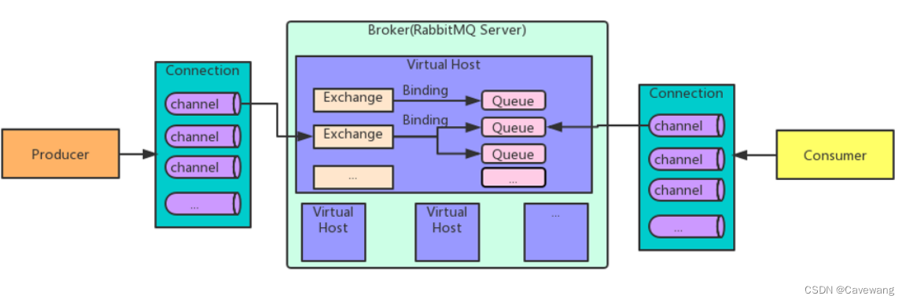

好的，下面我将为您重新生成一篇更加详细和全面的 RabbitMQ 从入门到精通的教程，基于 Python 实现。

---

# RabbitMQ 从入门到精通（基于 Python）



## 一、RabbitMQ 概述

### 1.1 什么是 RabbitMQ？
RabbitMQ 是一个基于 AMQP（Advanced Message Queuing Protocol，高级消息队列协议）协议的开源消息代理系统，用于在分布式系统中进行异步通信。它通过消息队列的形式在生产者（Producer）和消费者（Consumer）之间传递消息，解耦各个服务，提高系统的扩展性、可维护性和可靠性。

### 1.2 RabbitMQ 的核心特点

- **多协议支持**：RabbitMQ 支持 AMQP、MQTT 和 STOMP 等协议。
- **高可用性**：支持集群部署，具备消息持久化和队列镜像等高可用特性。
- **消息确认机制**：包括生产者确认、消费者确认和手动消息确认，保障消息不会丢失。
- **灵活的消息路由**：通过交换器（Exchange）实现复杂的路由机制，支持广播、路由键匹配等。

### 1.3 RabbitMQ 的应用场景

- **解耦**：服务之间可以通过消息队列解耦，减少服务之间的依赖。
- **异步通信**：允许服务通过队列异步处理任务，避免长时间阻塞。
- **流量削峰**：在高并发场景下，通过消息队列暂存大量请求，削峰填谷。
- **延迟任务**：可以实现延迟队列，用于延迟处理某些任务。

---

## 二、RabbitMQ 安装与环境配置

### 2.1 安装 RabbitMQ

#### 2.1.1 安装 Erlang
RabbitMQ 依赖于 Erlang 语言环境。首先需要安装 Erlang。

- **Mac** 上使用 Homebrew 安装：
```bash
  brew install erlang
```

- **Ubuntu** 上使用 APT 安装：
```bash
  sudo apt-get install erlang
```

#### 2.1.2 安装 RabbitMQ

- **Mac** 上通过 Homebrew 安装 RabbitMQ：
```bash
  brew install rabbitmq
```

- **Ubuntu** 上通过 APT 安装：
```bash
  sudo apt-get install rabbitmq-server
```

#### 2.1.3 启动 RabbitMQ 服务
RabbitMQ 安装完成后，启动服务：
```bash
rabbitmq-server
```

后台运行：
```bash
rabbitmq-server -detached
```

#### 2.1.4 启动 RabbitMQ Web 管理插件
RabbitMQ 提供了 Web 管理界面，用于监控和管理消息队列，默认端口为 `15672`。
启动 Web 管理插件：
```bash
rabbitmq-plugins enable rabbitmq_management
```
访问地址为：[http://localhost:15672](http://localhost:15672)，默认用户名和密码是 `guest/guest`。

### 2.2 Python 环境配置
RabbitMQ 的 Python 客户端主要使用 `pika` 库。首先安装 `pika`：
```bash
pip install pika
```

---

## 三、RabbitMQ 的核心概念

### 3.1 消息传递模型
RabbitMQ 的消息传递基于以下核心组件：
 
- **Producer（生产者）**：发送消息的程序。
- **Exchange（交换器）**：接收生产者发送的消息，并根据路由规则将消息转发到合适的队列。
- **Queue（队列）**：存储消息的容器，消费者从队列中接收消息进行处理。
- **Consumer（消费者）**：接收消息的程序，从队列中取出并处理消息。
- **Binding（绑定）**：交换器与队列之间的绑定关系，定义消息如何从交换器路由到队列。

### 3.2 交换器类型
RabbitMQ 支持四种不同类型的交换器，每种类型都有不同的消息路由规则：
1. **Direct Exchange（直连交换器）**：根据完全匹配的路由键将消息路由到相应队列。
2. **Fanout Exchange（扇出交换器）**：将消息广播到所有绑定的队列，无需路由键。
3. **Topic Exchange（主题交换器）**：通过模式匹配的方式，根据路由键中的通配符将消息路由到相应队列。
4. **Headers Exchange（头交换器）**：根据消息头中的属性字段路由消息，不使用路由键。

### 3.3 队列与消息持久化
- **持久化队列**：队列在 RabbitMQ 重启后依然存在。创建队列时通过 `durable=True` 使队列持久化。
- **持久化消息**：通过设置消息的 `delivery_mode=2` 使消息持久化到磁盘，避免 RabbitMQ 宕机时消息丢失。

### 3.4 消息确认机制
RabbitMQ 支持消息确认机制，用于确保消息被正确处理。主要包括：
- **生产者确认**：确保消息已成功到达交换器。
- **消费者确认**：消费者处理消息后发送确认，防止消息丢失。
- **手动确认**：通过手动发送确认，消费者可以确保消息处理完毕再从队列中删除消息。

---

## 四、RabbitMQ 基本操作（基于 Python）

### 4.1 生产者示例

生产者负责向 RabbitMQ 发送消息。下面是一个生产者的示例代码，它将一条消息发送到 RabbitMQ 的队列。

```python
import pika

# 连接到 RabbitMQ 服务器
connection = pika.BlockingConnection(pika.ConnectionParameters('localhost'))
channel = connection.channel()

# 声明队列（如果队列不存在则创建）
channel.queue_declare(queue='hello', durable=True)

# 发送消息
channel.basic_publish(exchange='',
                      routing_key='hello',
                      body='Hello World!',
                      properties=pika.BasicProperties(
                          delivery_mode=2,  # 使消息持久化
                      ))

print(" [x] Sent 'Hello World!'")

# 关闭连接
connection.close()
```

#### 代码详解
1. **连接到 RabbitMQ 服务器**：通过 `pika.ConnectionParameters` 连接本地的 RabbitMQ 服务。
2. **声明队列**：如果队列不存在则创建队列。`queue_declare` 中的 `durable=True` 使队列持久化。
3. **发送消息**：通过 `basic_publish` 发送消息到指定的队列，`delivery_mode=2` 使消息持久化。
4. **关闭连接**：发送完消息后关闭连接。

### 4.2 消费者示例

消费者从 RabbitMQ 队列中接收消息并进行处理。下面是一个消费者的示例代码。

```python
import pika

# 连接到 RabbitMQ 服务器
connection = pika.BlockingConnection(pika.ConnectionParameters('localhost'))
channel = connection.channel()

# 声明队列（确保队列存在）
channel.queue_declare(queue='hello', durable=True)

# 定义回调函数来处理接收到的消息
def callback(ch, method, properties, body):
    print(f" [x] Received {body}")
    # 手动确认消息已被处理
    ch.basic_ack(delivery_tag=method.delivery_tag)

# 设置消费者
channel.basic_consume(queue='hello', on_message_callback=callback, auto_ack=False)

print(' [*] Waiting for messages. To exit press CTRL+C')
channel.start_consuming()
```

#### 代码详解
1. **声明队列**：在消费者启动时，声明要监听的队列。确保队列存在，防止消息发送方还未声明队列时出现错误。
2. **定义回调函数**：`callback` 函数用于处理接收到的消息，处理完消息后通过 `basic_ack` 手动确认消息已被处理。
3. **开始消费**：`start_consuming` 开始监听队列并消费消息。

### 4.3 发布/订阅模式

RabbitMQ 通过 `Fanout Exchange` 实现消息的广播功能。生产者发送的消息将被广播到所有绑定到该交换器的队列上，消费者从这些队列中接收消息。

#### 发布者代码示例
```python
import pika

# 连接到 RabbitMQ 服务器
connection = pika.BlockingConnection(pika.ConnectionParameters('localhost'))
channel = connection.channel()

# 声明扇出交换器
channel.exchange_declare(exchange='logs', exchange_type='fanout')

# 发送消息
message = "info: Hello RabbitMQ!"
channel.basic_publish(exchange='logs', routing_key='', body=message)
print(f" [x] Sent {message}")

# 关闭连接
connection.close()
```

#### 消费者代码示例
```python
import pika

# 连接到 RabbitMQ 服务器
connection = pika.BlockingConnection(pika.ConnectionParameters('localhost'))
channel = connection.channel()

#

 声明扇出交换器
channel.exchange_declare(exchange='logs', exchange_type='fanout')

# 创建一个临时队列，程序退出时删除该队列
result = channel.queue_declare(queue='', exclusive=True)
queue_name = result.method.queue

# 绑定队列到交换器
channel.queue_bind(exchange='logs', queue=queue_name)

print(' [*] Waiting for logs. To exit press CTRL+C')

# 定义回调函数
def callback(ch, method, properties, body):
    print(f" [x] {body}")

# 设置消费者
channel.basic_consume(queue=queue_name, on_message_callback=callback, auto_ack=True)

channel.start_consuming()
```

#### 代码详解
1. **声明交换器**：使用 `fanout` 类型交换器将消息广播给所有绑定的队列。
2. **临时队列**：消费者在启动时创建一个临时队列，程序退出时该队列会自动删除。通过 `queue_declare(queue='', exclusive=True)` 实现。
3. **绑定队列到交换器**：通过 `queue_bind` 将队列绑定到交换器上。

---

## 五、RabbitMQ 高级特性

### 5.1 消息持久化
RabbitMQ 提供持久化机制，确保消息在系统崩溃或重启时不会丢失。可以通过以下几种方式实现消息持久化：
- **持久化队列**：队列声明时设置 `durable=True`，使队列持久化。
- **持久化消息**：发送消息时设置 `delivery_mode=2`，将消息持久化到磁盘。

### 5.2 消息确认机制
RabbitMQ 的消费者在消费消息时，可以选择是否手动确认消息。手动确认消息可以确保消息被正确处理。
- **auto_ack=False**：关闭自动确认，需要手动调用 `ch.basic_ack` 进行消息确认。
- **basic_nack**：当消息处理失败时，消费者可以拒绝该消息，通过 `basic_nack` 让消息重新入队或进入死信队列。

### 5.3 死信队列（DLQ）
死信队列用于处理无法被正常消费的消息。以下几种情况会将消息发送到死信队列：
- 消息被消费者拒绝并且不再重新入队。
- 消息在队列中存活时间超过 `TTL`（Time-To-Live）。
- 队列的最大长度已满，消息无法再被存储。

### 5.4 延迟队列
RabbitMQ 没有直接支持延迟队列的功能，但可以通过设置消息 `TTL`（Time-To-Live） 实现。消息在 TTL 到期之前不会被消费者接收。

示例代码：
```python
args = {'x-message-ttl': 60000}  # 设置消息存活时间为 60 秒
channel.queue_declare(queue='delayed_queue', arguments=args)
```

### 5.5 消息优先级
RabbitMQ 允许为队列中的消息设置优先级，消费者会优先消费高优先级的消息。在声明队列时需要设置最大优先级。

```python
args = {'x-max-priority': 10}  # 设置最大优先级为 10
channel.queue_declare(queue='priority_queue', arguments=args)
```

在发送消息时，通过 `priority` 参数设置消息优先级。

```python
channel.basic_publish(
    exchange='',
    routing_key='priority_queue',
    body='High priority message',
    properties=pika.BasicProperties(priority=10)
)
```

---

## 六、RabbitMQ 集群与高可用

### 6.1 RabbitMQ 集群概述
RabbitMQ 支持集群部署，多个 RabbitMQ 节点组成集群，可以共同处理消息。集群的目标是提高系统的可用性、扩展性和容错能力。

### 6.2 队列镜像
为了实现高可用，RabbitMQ 支持将队列在集群中的多个节点上进行镜像。队列镜像可以确保一个节点宕机时，其他节点上依然有该队列的备份。

### 6.3 消息分区
RabbitMQ 支持将消息分布到集群的不同节点上，实现负载均衡。

---

## 七、RabbitMQ 性能优化

### 7.1 消息批量处理
为了提高性能，可以批量确认消息或批量发送消息。例如，消费者可以在处理完多个消息后，一次性确认所有消息。

### 7.2 消费者预取（Prefetch）
通过设置 `basic_qos` 的 `prefetch_count` 参数，可以控制每个消费者一次接收的消息数量，避免消息堆积过多导致内存耗尽。

```python
channel.basic_qos(prefetch_count=1)
```

---

## 八、总结

RabbitMQ 作为一个成熟的消息队列系统，具备丰富的特性，支持多种协议、持久化、消息确认、延迟队列和优先级队列等高级功能。通过 Python 操作 RabbitMQ，可以轻松实现异步通信、消息解耦、负载均衡等功能，为分布式系统提供了强大的支持。

